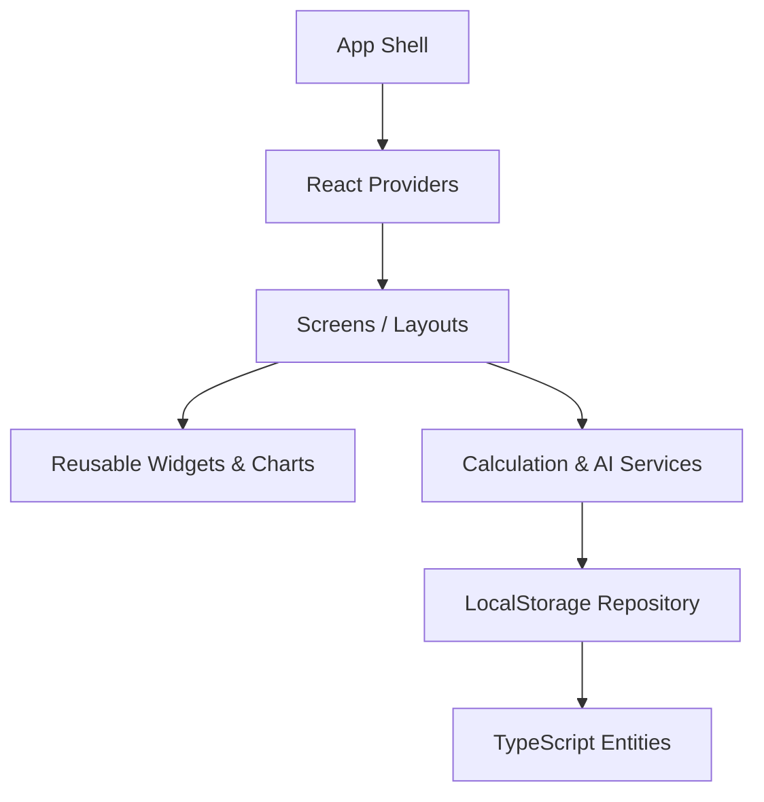

# Architecture & System Design

This document details the software architecture, design principles, and folder structures implemented in the Carbon Footprint Awareness Platform.

## System Architecture

The project is structured following **Clean Architecture** principles to isolate the user interface from storage layers, calculation engines, and external API services.

```
src/
├── features/         # Custom hooks and domain workflows
├── services/         # Core business calculations, PDF formatting, and AI coaching
├── models/           # Domain entities and TypeScript types
├── repositories/     # Data storage interfaces (LocalStorage Repository)
├── providers/        # React context providers for app-wide state
├── widgets/          # Reusable UI elements and charts
├── screens/          # Main page layouts
└── utils/            # Math and formatting utilities
```



## Key Modules

### 1. Calculation Engine (`services/calculatorEngine.ts`)
Uses customizable emission factors stored in `constants/emissionFactors.ts` to compute detailed CO₂ equivalents (in kg CO₂e) for transit distance, household energy, water usage, eating habits, and shopping choices.

### 2. State & Persistence (`providers/AppContext.tsx`)
Coordinates global app data, streaks, and logging. Reads and persists data via the `storageRepository.ts` file, seeding 14 days of realistic logs on fresh startup to populate charts instantly.

### 3. AI Sustainability Coach (`services/aiCoachService.ts`)
Optionally links to Google's Gemini API via `.env` configuration. Falls back on a complex, localized client-side heuristic analyzer to explain emission contributors and suggest reduction actions.

### 4. Accessibility & Responsive Visualization (`widgets/AccessibleChart.tsx`)
Renders custom SVG charts styled with modern HSL color palettes. Satisfies WCAG 2.1 guidelines by binding title and description labels, and provides a keyboard-navigable button to toggle between the graphical chart and a semantic HTML data table.
